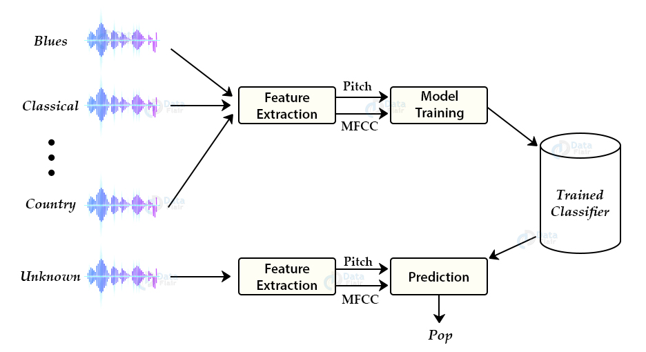

# __Music Genre Classifier__

### __Introduction__

- In this tutorial we are going to develop a `deep learning project` to automatically classify different musical genres from audio files. 
- We will classify these audio files using their `low-level features of frequency and time domain`.
- For this project we need a dataset of audio tracks having similar size and similar frequency range. 
- `GTZAN genre classification dataset` is the most recommended dataset for the music genre classification project and it was collected for this task only.




<hr/>

### __About the Dataset__
- The GTZAN genre collection dataset was collected in 2000-2001. 
- It consists of `1000 audio files` each having 30 seconds duration. 
- There are 10 classes ( 10 music genres) each containing 100 audio tracks. 
- Each track is in `.wav format`. 
- __It contains audio files of the following 10 genres:__
    - Blues
    - Classical
    - Country
    - Disco
    - Hiphop
    - Jazz
    - Metal
    - Pop
    - Reggae
    - Rock

<hr/>

### __Approach__

- There are various methods to perform classification on this dataset. 
- __Some of these approaches are:__
    - Multiclass support vector machines
    - K-means clustering
    - K-nearest neighbors
    - Convolutional neural networks
- We will use `K-nearest neighbors algorithm` because in various researches it has shown the best results for this problem.
- K-Nearest Neighbors is a popular machine learning algorithm for `regression` and `classification`. 
- It makes predictions on `data points` based on their `similarity measures` i.e distance between them.

<hr/>

### __Feature Extraction__

- The first step for music genre classification project would be to extract features and components from the audio files.
- It includes `identifying the linguistic content` and `discarding noise`.

<hr/>

### __Mel Frequency Cepstral Coefficients:__
- These are `state-of-the-art features` used in `automatic speech` and `speech recognition studies`. 
- __There are a set of steps for generation of these features:__

    - Since the audio signals are constantly changing, first we `divide these signals into smaller frames`. 
    - Each frame is around `20-40 ms long`
    - Then we try to identify different frequencies present in each frame
    - Now, separate `linguistic frequencies` from the noise
    - To discard the noise, it then takes `discrete cosine transform` (DCT) of these frequencies. 
    - Using DCT we keep only a `specific sequence of frequencies` that have a high probability of information.

<hr/>

### __STEPS__

1. Download the GTZAN dataset from the following link: [GTZAN dataset](http://marsyas.info/downloads/datasets.html)

2. In [music_genre.py](./music_genre.py)
    - Follow the instructions shown in the code

3. Test the classifier with new audio file
    - Save the new audio file in the present directory. 
    - Make a new file [test.py](./test.py)

4. Run this script to get the prediction:
```python
python3 test.py
```